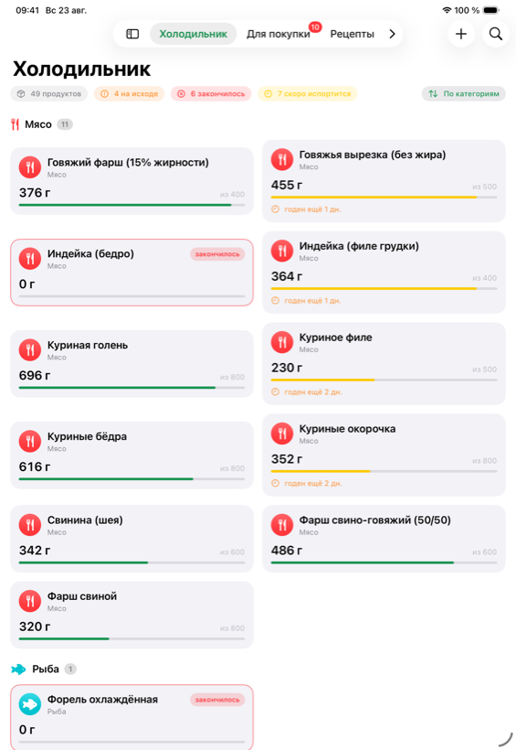
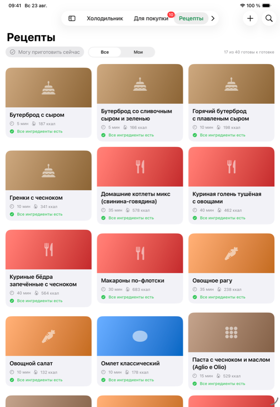
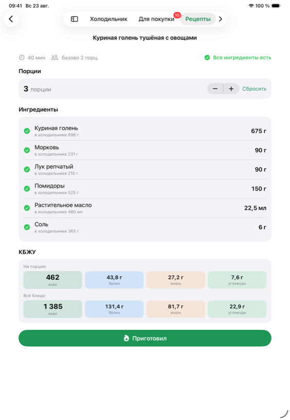
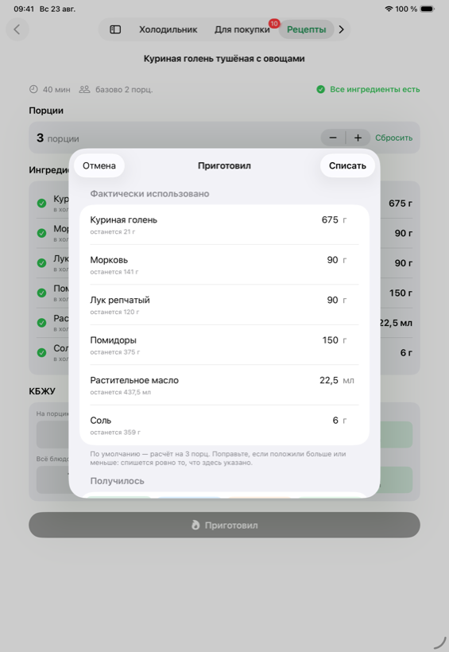
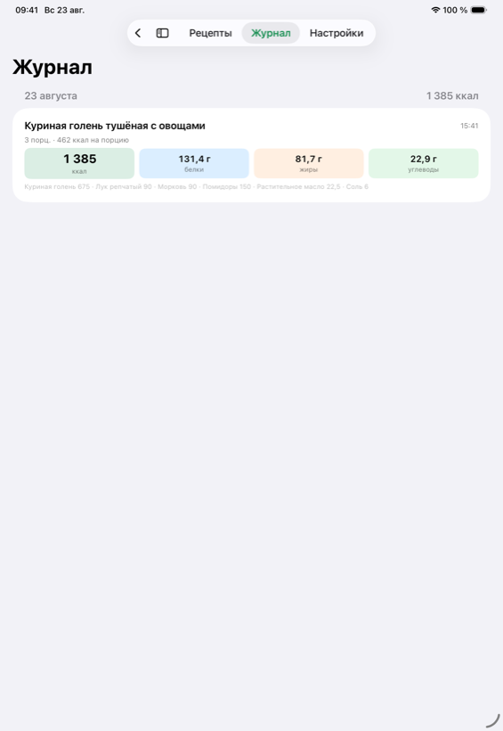
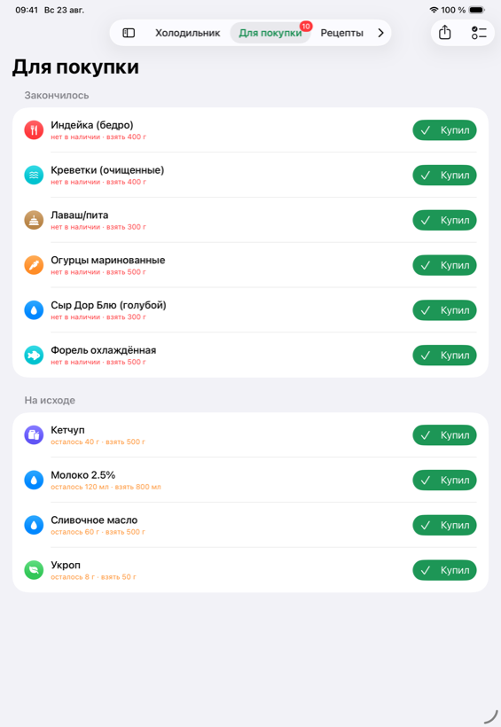
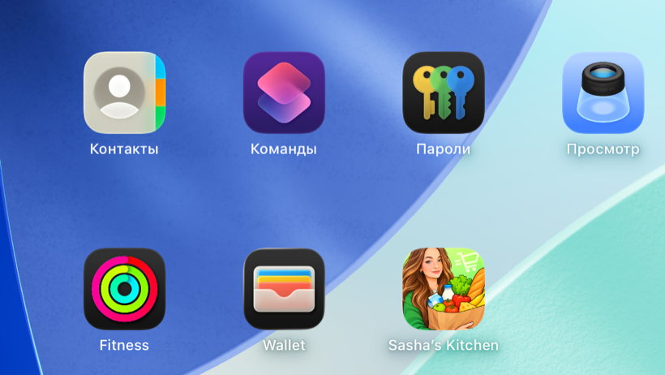

# Sasha’s Kitchen

**iPad-приложение для учёта продуктов дома.** Показывает, что лежит в
холодильнике, что из этого можно приготовить прямо сейчас и сколько это в КБЖУ.
При готовке фактически использованный вес списывается с остатков, а то, что
закончилось, само собирается во вкладку «Для покупки» — оттуда список уходит в
Напоминания настоящим чек-листом или текстом в iMessage и Заметки.

SwiftUI + SwiftData, Swift 6, без внешних зависимостей. Только iPad, iPadOS 26.

<br clear="right">

---

## Как это работает

### Холодильник

49 продуктов с остатками, прогресс-баром от изначального объёма и подсветкой
того, что заканчивается или скоро испортится. Поиск, сортировка по категориям,
остатку, сроку годности или названию.



### Рецепты

40 рецептов. У каждого — бейдж «Все ингредиенты есть» или «Не хватает: …»,
пересчитанный по текущим остаткам. Фильтр «Могу приготовить сейчас» оставляет
только то, что собирается из наличного. Цвет карточки берётся от главного
ингредиента: мясные — красные, рыбные — бирюзовые, хлебные — коричневые.



### Карточка рецепта

Степпер порций пересчитывает граммовки и КБЖУ на лету. Против каждого
ингредиента видно, сколько его в холодильнике и хватает ли.



### «Приготовил» → списание

Перед списанием приложение показывает расчётные граммовки и даёт их поправить:
спишется ровно то, что реально ушло в кастрюлю. Под каждой строкой — сколько
останется. В минус холодильник не уходит.



### Журнал

Что и когда приготовили, с фактическими граммовками и КБЖУ.



### Для покупки

Заполняется сам: сюда попадает всё, что кончилось или ушло ниже порога.
«Купил» пополняет остаток, «В Напоминания» создаёт системный список «Купить» с
настоящими чекбоксами, «Поделиться» отдаёт текстовый чек-лист.



---

## Запуск

```bash
./Scripts/run-ipad.sh
```

Скрипт соберёт проект, поднимет симулятор iPad Pro 11" и запустит приложение.
Другое устройство — параметром: `./Scripts/run-ipad.sh "iPad Air 13-inch (M4)"`.

Из Xcode: открыть `FridgeOracle.xcodeproj`, схема **FridgeOracle**, любой
симулятор iPad.

## Тесты

```bash
xcodebuild -project FridgeOracle.xcodeproj -scheme FridgeOracle \
  -destination 'platform=iOS Simulator,name=iPad Pro 11-inch (M5)' test
```

**32 модульных теста в 6 наборах и 3 UI-теста.** Модульные проверяют расчёт
КБЖУ, пересчёт под порции, доступность рецептов, списание остатков и целостность
стартовых данных. UI-тесты проходят главный сценарий целиком: открыть рецепт →
изменить порции → «Приготовил» → «Списать» → увидеть запись в журнале.

## Устройство проекта

| Путь | Что там |
|---|---|
| `Sources/Model/` | Модели SwiftData: продукт, остаток, рецепт, ингредиент, журнал |
| `Sources/Services/` | Списание, пополнение, доступность рецептов, Напоминания, звук |
| `Sources/Support/` | Расчёт КБЖУ и форматирование — чистые типы без SwiftData |
| `Sources/Seed/` | Стартовые данные, **генерируются** из `starter-data.md` |
| `Tests/`, `UITests/` | Swift Testing и XCUITest |
| `Design/` | Исходная иллюстрация для иконки |

Стартовые 49 продуктов и 40 рецептов не написаны руками:
`Scripts/generate_seed.py` разбирает исходный markdown с таблицей КБЖУ и
рецептами и собирает из него Swift-файл, попутно проверяя, что каждый из 188
ингредиентов ссылается на существующий продукт.

Звуковые сигналы тоже не лежат файлами — они синтезируются в памяти
(`Services/ToneFactory.swift`) и играют в категории `.ambient`, чтобы не глушить
музыку.

Подробности архитектуры, инварианты и ловушки — в [CLAUDE.md](CLAUDE.md).

## Что не вошло

Сканер штрихкода с Open Food Facts, синхронизация через CloudKit и
пуш-уведомления об истекающем сроке — вторая фаза. Место в интерфейсе под сканер
и запрос разрешения на камеру заложены уже сейчас.

## Лицензия

[MIT](LICENSE). Иллюстрация в `Design/icon-source.png` и производная от неё
иконка — исключение: на них лицензия не распространяется, это личное
изображение.

## На домашнем экране



Иконка собрана из иллюстрации в `Design/icon-source.png` скриптом
`Scripts/make-appicon.swift`: у исходника скругление и рамка были зашиты в
пиксели, и их пришлось срезать — iOS накладывает свою маску поверх.
